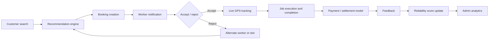

# 🛠 ServiFlow: Engineering-Driven Service Booking & Scheduling System

ServiFlow is an optimized full-stack service platform designed for high-transparency coordination between professional service workers and customers. The system architecture prioritizes mathematical precision in routing, scheduling, and resource allocation.

---

## 📐 Algorithmic Infrastructure

### 1. Worker Recommendation Algorithm
The system uses a weighted multi-factor score with a **hard service-zone filter**: workers whose **base** (`profile.location`) is farther than `profile.serviceRadiusKm` from the **customer destination** are excluded from results.

After **service-zone filtering** (worker base within `serviceRadiusKm` of the customer’s destination), each worker gets:

**Formula:**

`Score = (in_zone ? 1 : 0) × (0.32×Distance_Score + 0.26×Rating_Score + 0.18×Availability + 0.14×Reliability_Blend + 0.10×Verified_Score)`

In practice, out-of-zone workers are removed in `filteredWorkers`, so they do not appear in the customer grid.

*   **Distance_Score**: Normalized proximity (1 − distance/50 km, capped at 0; default 0.5 if unknown).
*   **Rating_Score**: Professional rating / 5.
*   **Availability**: 1 if the worker has **no overlapping booking** in the selected date/time window (60-minute slots), else 0 (`isWorkerSlotBlocked` in `frontend/src/lib/scheduling.ts`).
*   **Reliability_Blend**: `0.55 × (completed / total jobs for worker) + 0.45 × (profile.reliabilityScore / 100)` (defaults apply when data is missing).
*   **Verified_Score**: `1` if `verification.status === 'verified'`, `0.55` if `pending`, `0.25` otherwise.

Results are sorted by `Score` descending; the UI shows up to six matches in the search grid.

### 2. Auto-Assign Decision Engine
ServiFlow reduces user friction by providing a "Best Match" automation system. This engine allows a customer to instantly select the highest-scoring professional without manual scrolling.

**Workflow:**
1.  **Contextual Filtering**: Filters all active professionals by the customer's selected category (e.g., "Plumber").
2.  **Global Scoring**: Executes the multi-factor algorithm (distance, rating, slot availability, blended reliability, verification signal) across workers who pass the **service zone** filter.
3.  **Real-Time Sorting**: Sorts the set by score descending.
4.  **Instant Selection**: Maps the worker with $score = max(S)$ and automatically populates the booking interface with their details.

This ensures that the "Best Match" is always mathematically the most optimized professional available at that specific moment.

### 3. Location intelligence, routing, and ETA

ServiFlow separates **preview distances** (fast, used for matching and sorting) from **trip routing** (accurate roads, used when a job is active and tracking is shown).

#### Trip routing (worker live location → booking site)

When a customer views **live tracking** (`frontend/src/components/TrackingMap.tsx`), the path is computed **along the road network** (OSRM); **straight-line** distance is used only in the **fallback** path described below:

- **Routing engine**: [OSRM](https://project-osrm.org/) (Open Source Routing Machine), exposed as a Route service.
- **Client integration**: **Leaflet Routing Machine** (`leaflet-routing-machine`) with `L.Routing.osrmv1`, pointed at the public demo router (`router.project-osrm.org`) in development. **Production** should use a **self-hosted or contracted OSRM/graph service** with rate limits, HTTPS, and an API key if required—do not rely on the public demo for scale.
- **Outputs**: **route distance** and **duration (ETA)** are read from the OSRM routing response and shown in the tracking UI. The map draws the **polyline** returned by the router.

**Fallback when routing fails** (network error, empty route, service down):

- The app falls back to **Haversine** (great-circle) distance between worker GPS and booking coordinates and estimates ETA with a **constant ~30 km/h** heuristic (labeled as approximate in the UI where implemented).
- This preserves a usable distance/ETA signal without blocking the tracking experience.

**Related**: `frontend/src/components/MapComponent.tsx` includes a **RouteLayer** that can call the OSRM **HTTP route API** directly for drawn routes, with a similar straight-line fallback on `fetch` failure.

#### Search and recommendation preview (not OSRM)

For **worker search**, **zone checks**, **scoring**, and **grid labels**, the app uses **Haversine** distance from the worker’s **base** (`profile.location`) to the **customer destination**, and a **30 km/h** heuristic ETA for quick display (`frontend/src/pages/CustomerDashboard.tsx`). That layer is intentionally lightweight so sorting and filtering stay snappy; it is **not** a substitute for the road-based route shown during live tracking.

### 4. Demand-Responsive Pricing (DRP)
Instead of a single fixed rate, quote price scales with **demand**, **lead time**, optional **explicit urgent** flag, and **worker rating**.

**Formula (as implemented in customer booking modal):**

`Price = Base_Price × Demand_Multiplier × Lead_Time_Multiplier × Urgent_Multiplier × Rating_Multiplier`

*   **Base_Price**: 50 (currency units as shown in UI).
*   **Demand_Multiplier**: `1 + (jobs_in_slot_for_category / max(1, workers_in_category)) × 1.5` (non-rejected, non-cancelled jobs in that slot).
*   **Lead_Time_Multiplier**: Same-day **1.3×**, next-day **1.1×**, otherwise **1.0×**.
*   **Urgent_Multiplier**: **1.35×** when the customer selects **Urgent service** (`booking.urgency === 'urgent'`).
*   **Rating_Multiplier**: `1 + Rating/10`.

---

## 📊 Admin Analytics & Metrics

Operational health is monitored through three core engineering metrics:

1.  **Worker Utilization Rate**: Measuring workforce efficiency.
    *   `Utilization = Active_Workers_On_Jobs / Total_Approved_Workers`
2.  **Platform cancellation / decline visibility**: Use **All Bookings** filters (`pending`, `accepted`, `completed`, `rejected`, **`cancelled`**) to audit outcomes. Some KPI formulas in the admin dashboard still treat **rejected** as the primary “negative” outcome; align reporting with your ops definition if you migrate fully to `cancelled` for customer cancels.
3.  **Demand Growth Velocity**: Tracking platform scaling.
    *   `Growth = (Current_Week_Bookings - Previous_Week_Bookings) / Previous_Week_Bookings`

---

## 🚀 Technology Stack

### **Frontend Infrastructure**
- **Framework**: `React` (with TypeScript)
- **Styling**: `Tailwind CSS v4` with a custom-themed indigo design system.
- **Animations**: `motion` for smooth transitions.
- **Mapping Engine**: `React-Leaflet` for maps; **Leaflet Routing Machine** + **OSRM** for **road-based** routes during live tracking (see § Algorithmic Infrastructure → Location intelligence).

### **Backend & Persistence**
- **Architecture**: `Node.js` Express wrapper for Firebase services (optional for extensions).
- **Persistence**: `Cloud Firestore` (NoSQL) for users, bookings, notifications.
- **File uploads**: `Firebase Storage` for worker verification documents (`worker_verification/{uid}/...`).
- **Security**: Client uses Firebase Auth; production should tighten **Firestore** and **Storage** rules (see below). Custom claims are noted as the long-term RBAC approach; the current app primarily uses `users.role` and `users.status` in Firestore for routing.

---

## 🔐 Authentication, Roles, and Admin Login

ServiFlow uses **two separate systems** that must be in sync:

- **Firebase Authentication (Auth)**: Stores the **email/password** used to sign in.
- **Cloud Firestore (`users` collection)**: Stores the app profile/role (e.g. `admin`, `customer`, `worker`) and routing logic uses this role to redirect after login.

### **Production setup (recommended)**

- **Create the admin user in Firebase Auth**:
  - Firebase Console → **Authentication** → **Users** → **Add user**
  - Use the admin email and set the password you want.
- **Create/verify the admin profile in Firestore**:
  - Firestore → `users` collection → document for that admin UID
  - Ensure `role: "admin"` is present.

If an email exists only in Firestore (and not in Auth), **email/password login will fail** with `auth/invalid-credential`.

### **Troubleshooting: `Firebase: Error (auth/invalid-credential)`**

- **Wrong Firebase project**: ensure your `firebase-applet-config.json` points to the same project where you created the Auth user.
- **User exists only in Firestore**: create the user in **Authentication → Users**.
- **Password mismatch**: reset the password in the Firebase Console or implement a “Forgot password” flow.

---

## 📍 Location Model (Coordinates First)

ServiFlow treats location as **GPS coordinates** everywhere (\(`{ lat, lng }`\)). Human-readable “address” is derived from coordinates and is not the source of truth.

### **Registration (home coordinates)**

During registration, users must provide their home location using one of:

- **Live GPS**: capture the device’s current coordinates.
- **Manual coordinates**: enter latitude/longitude and apply.

Saved to Firestore under:

- `users/{uid}.profile.location`: `{ lat, lng }` (source of truth)
- `users/{uid}.profile.address`: best-effort reverse geocoded label (falls back to `lat,lng`)

Implemented in `frontend/src/pages/Register.tsx`.

### **Customer → Booking destination**

When a customer requests a worker, the booking destination is always coordinates, chosen from:

- **Live GPS** (current position)
- **Saved Home** (from `users/{uid}.profile.location`)
- **Manual coordinates** (entered lat/lng)

Saved to Firestore under:

- `bookings/{bookingId}.location`: `{ lat, lng }`

Implemented in `frontend/src/pages/CustomerDashboard.tsx`.

### **Worker live tracking**

Workers publish **live GPS coordinates** (continuous updates) to:

- `users/{uid}.profile.location`

The customer “tracking” view reads this live location and computes a **road route** to the booking destination via **OSRM + Leaflet Routing Machine**, with **Haversine + heuristic ETA** as backup if routing fails.

Implemented in `frontend/src/pages/WorkerDashboard.tsx` and `frontend/src/components/TrackingMap.tsx`.

---

## End-to-end system flow (continuous pipeline)

ServiFlow is designed as a **single operational pipeline**: each stage hands state to the next. Modules are not isolated silos—they share Firestore documents, notifications, and UI surfaces tied to the same booking lifecycle.



**Narrative (production-oriented):**

1. **Customer → Search**: The customer picks category, destination (GPS / saved home / manual), and time context. Workers are filtered by **service zone** and scored.
2. **Worker recommendation**: Weighted scoring ranks professionals; **auto-assign** selects the top match instantly.
3. **Booking creation**: A booking document is written with slot, location, urgency, and status **pending**; **overlap** checks reduce double-booking.
4. **Worker notification**: Workers see the request (urgent jobs surfaced first); the pipeline waits on a decision.
5. **Accept / reject**: On **accept**, status moves to **accepted** and tracking becomes meaningful. On **reject**, the product path is **re-run the recommendation funnel** (next-best worker or different slot)—see **Failure handling**.
6. **Live GPS tracking**: Worker location updates feed the map; **OSRM + Leaflet Routing Machine** produce distance and ETA to the job site, with **Haversine fallback** if routing fails.
7. **Job execution → completion**: Status transitions reflect on-site work finishing; timestamps drive reliability rules.
8. **Payment processing**: Document how your deployment handles settlement (integrated gateway vs. manual); the app’s **DRP** logic sets displayed quotes—wire this to your processor of record in production.
9. **Feedback submission**: Reviews reinforce trust signals used in scoring.
10. **Reliability score update**: Completes, lateness, and rejections adjust **`profile.reliabilityScore`** / stats.
11. **Admin analytics**: Utilization, demand, cancellation/rejection visibility, and verification queues inform operations.

---

## Failure handling and graceful degradation

| Scenario | Behavior |
|----------|----------|
| **Worker rejects request** | Customer should be guided to **another ranked worker** or **another slot**; scoring already orders alternatives—surface the next best matches and refresh slot suggestions (`suggestSlotsForWorker`). |
| **No workers available** (empty after zone + category filters) | Encourage **different time slots** using **smart slot suggestions** (low-demand, worker-free windows) or broaden category / destination where business rules allow. |
| **Location unavailable** (GPS denied, invalid manual entry) | Fall back to **saved profile coordinates** (`users/{uid}.profile.location`) where the UI offers “Saved Home”; validation should block bookings without a resolvable `{ lat, lng }`. |
| **Routing API failure** | **Haversine** distance + **~30 km/h** ETA approximation for tracking (and map still centers on worker/booking). Replace public OSRM with a stable hosted endpoint in production. |
| **Booking conflicts / overlap** | **Client-side** `isWorkerSlotBlocked` prevents overlapping assignments for the same worker and slot window; treat server-side idempotency and transactional creates as a **production hardening** step if you expose APIs beyond this app. |

Edge cases should **degrade** (approximate ETA, next-best worker) rather than **hard-fail** the user when a non-critical subsystem (e.g. one routing HTTP call) is unavailable.

---

## Scalability considerations (lightweight)

- **Indexed queries**: For large deployments, add **composite indexes** for common filters (e.g. `status` + `scheduledAt`, `workerId` + `slotKey`) and geo queries if you move to GeoFirestore or regional partitioning. The current demo often reads bounded collections—plan indexes before 10⁵+ bookings.
- **Pagination**: List views (**All bookings**, **My bookings**) should use **limit + startAfter** cursors in Firestore for long histories; keep default page sizes small.
- **Caching**: Cache **worker directory** slices (category, verified flag, base location) in memory or a CDN layer for repeat searches; invalidate on profile updates.
- **Firestore structure**: Prefer **flat documents** (`bookings`, `users`) over **deep nesting**; store denormalized labels (worker name snapshotted on booking) only when read patterns justify it to avoid **collection group** explosions and heavy fan-out reads.

---

## ✅ Worker verification, scheduling, and operations

### **Certificate & skills verification**

- Workers upload **PDF/images** to Firebase Storage (`worker_verification/{uid}/...`) and set **skills** + **years of experience** on **Verification** (`/worker/verification`).
- Submissions set `users/{uid}.profile.verification.status` to `pending` and store `certificateUrls`, `skills`, `experienceYears`, `submittedAt`.
- Admins review on **Verification** (`/admin/verification`): **approve** or **reject** with `adminRemarks` and `reviewedAt`.
- **Verified** professionals get a higher weight in customer **recommendation scoring** (`frontend/src/pages/CustomerDashboard.tsx`).
- **Storage**: enable Firebase Storage and deploy rules. Example (adjust for your security model):

```text
rules_version = '2';
service firebase.storage {
  match /b/{bucket}/o {
    match /worker_verification/{userId}/{allPaths=**} {
      allow read: if request.auth != null;
      allow write: if request.auth != null && request.auth.uid == userId;
    }
  }
}
```

### **App routes (high level)**

| Role | Path | Purpose |
|------|------|---------|
| Admin | `/admin` | Worker onboarding approvals |
| Admin | `/admin/verification` | Certificate / skills verification queue |
| Admin | `/admin/bookings` | All bookings |
| Customer | `/customer` | Search & book |
| Customer | `/customer/bookings` | My bookings & cancel |
| Worker | `/worker` | Schedule, analytics, active jobs |
| Worker | `/worker/requests` | Pending requests (urgent first) |
| Worker | `/worker/verification` | Upload certs, skills, zone |
| Worker | `/worker/reviews` | Reviews |

### **Key modules**

- `frontend/src/lib/scheduling.ts` — slot constants, overlap, demand, suggestions.
- `frontend/src/lib/reliability.ts` — `reliabilityScore` / stats updates.
- `frontend/src/services/bookingService.ts` — create booking, status changes, cancel, notifications hooks.
- `frontend/src/types.ts` — `Booking`, `UserProfile`, verification and reliability fields.

### **Time-slot scheduling (60-minute blocks)**

- Standard slots: `09:00`–`17:00` (`frontend/src/lib/scheduling.ts`).
- Each booking carries `slotDurationMinutes` (default **60**). **Overlap** uses interval overlap, not only identical start times.
- **Double-booking** is blocked client-side when creating a booking (`isWorkerSlotBlocked`).
- **Worker schedule grid** (schedule view): pick a date to see each slot as **Available**, **Pending**, **Confirmed**, or **Done**.

### **Smart slot suggestions**

- When booking, the modal shows **low-demand, free** slots first (`suggestSlotsForWorker`: sorts by worker availability, then platform demand for that category/date/slot).

### **Urgency**

- Customers can mark **Urgent service** in the booking modal → `bookings/{id}.urgency = 'urgent'`, **higher dynamic price** (urgent multiplier), worker notifications say urgent; **New Requests** highlights urgent jobs first.

### **Service zone**

- `users/{uid}.profile.serviceRadiusKm` (default **15** km at worker registration, editable on verification page).
- **Customer** search filters out workers whose **base** location is farther than the worker’s radius from the **customer destination** coordinates; booking creation also rejects destinations outside that radius.
- **Workers** cannot **accept** a job if the job site is outside their configured radius (relative to worker **profile** base location).

### **Reliability score**

- `users/{uid}.profile.reliabilityScore` (0–100) and `reliabilityStats` (`cancellations`, `delays`, `onTimeCompletes`).
- **Worker decline/reject** on a booking: score reduced (`worker_reject`).
- **Complete job late** (completed after scheduled slot end + grace): `completed_late`; **on-time** completion: small bump (`completed_ontime`).
- **Customer cancel** does not penalize the worker; **worker-initiated cancel** path can use `cancelBooking(..., 'worker')` for penalties where applicable.

### **Job analytics (worker)**

- **Earnings by hour of day** from completed jobs (bar chart on schedule view).
- Existing **peak hour** stats remain from assignment timestamps.

---

## 🏗 Engineering limitations and honest boundaries

While ServiFlow provides a robust coordinating environment, the following boundaries matter for production planning:

*   **Traffic and live conditions**: Even **road-based** OSRM routes do not inherently include **live traffic**; fallback ETA uses **30 km/h**. Integrate a traffic-aware provider if SLA requires it.
*   **Two distance modes**: **Search and scoring** use **Haversine** from worker **base** to destination for speed; **tracking** uses **OSRM** from **live GPS** to destination when the service succeeds. Do not present them as the same number without labeling context.
*   **Public OSRM demo**: The bundled default endpoint is for **development**; production needs **owned infrastructure** or a vendor SLA (rate limits, privacy, regions).
*   **Heuristic recommendations**: The recommendation engine is **rule-based** (weighted signals), not a learned ranker or collaborative filter.
*   **Firestore at scale**: Throughput, hot documents, and index cardinality require **pagination**, **sharding by region or tenant**, and **careful composite indexes** at high volume.

---

## Product experience (why the system feels “production ready”)

Beyond algorithms, ServiFlow is shaped for **low friction** and **trust**:

- **Smart slot suggestions** reduce decision effort by surfacing **low-demand, available** windows first.
- **Auto-assign** applies the same scoring engine as search to pick the **best match** in one action.
- **Verified badge** (admin-approved verification) increases **selection confidence** and feeds the recommendation score.
- **Urgency** (`urgent` bookings) increases **priority** in worker queues and **price** via DRP—clear tradeoff for faster attention.
- **Real-time tracking** with **road routes** (when OSRM is healthy) improves **transparency**; fallback keeps the experience **continuous** if routing fails.

---

## 🎨 UI/UX design system

The application uses a premium, SaaS-grade design system focused on hierarchy and clarity:

- **Palette**: Slate-900 (Primary Text), Indigo-600 (Action), Emerald (Positive Status).
- **Typography**: Inter (Sans-serif) optimized for clarity across mobile and desktop breakpoints.
